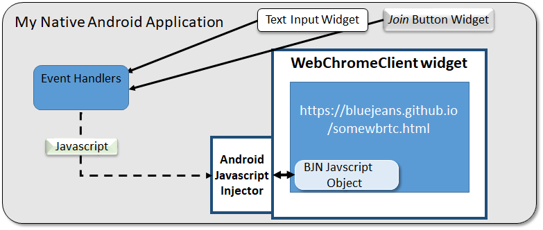

# Reference Application: Native Android Application with BlueJeans Calling

##Utilizing BlueJeans via generic WebRTC Web Page 

Feb 2018 by Glenn Inn,  glenninn@yahoo.com

This sample Android application demonstrates how one can provide BlueJeans video connectivity in a native Android application without a full-fledged SDK.

The general method involves placing a WebChromeClient object on the application's user interface.  This widget acts like a Google Chrome browser, which has native support for WebRTC.  That object is programmatically directed to browse to a site that hosts an HTML page formatted for the Android device.

** Note ** The HTML page need not expose any user controls, (for example the Join Meeting Button), as all these control functions can be invoked from the Android Application via a method called Javascript injection.

### Disclaimer

This application is provided for reference only.  Use at your own risk, but feel free to provide feedback comments to:  [Glenn Inn](mailto:glenn@bluejeans.com)

